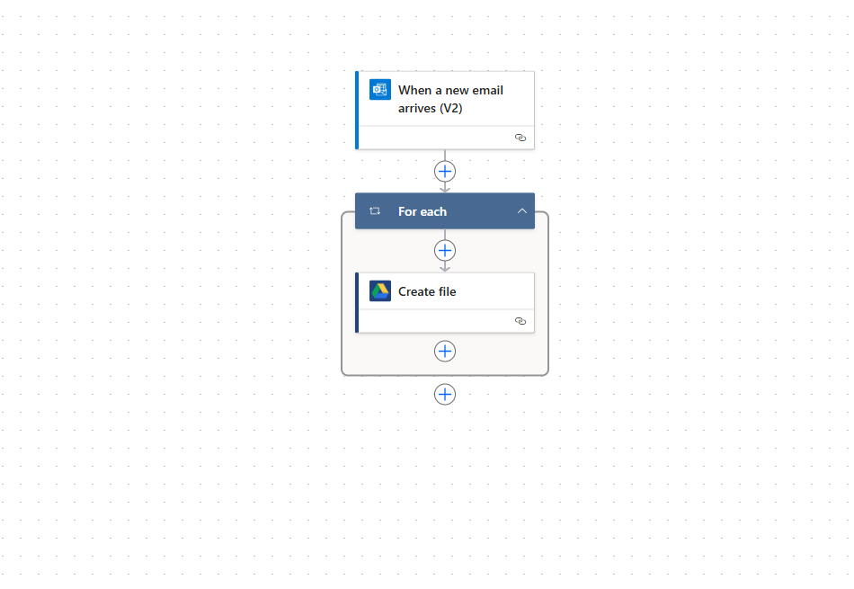
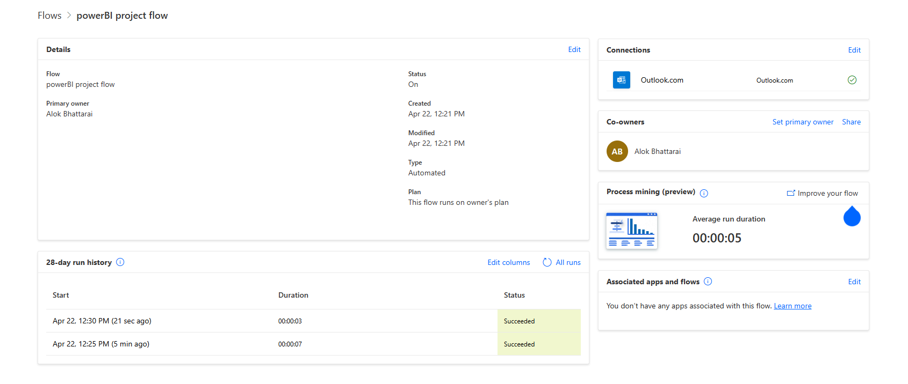
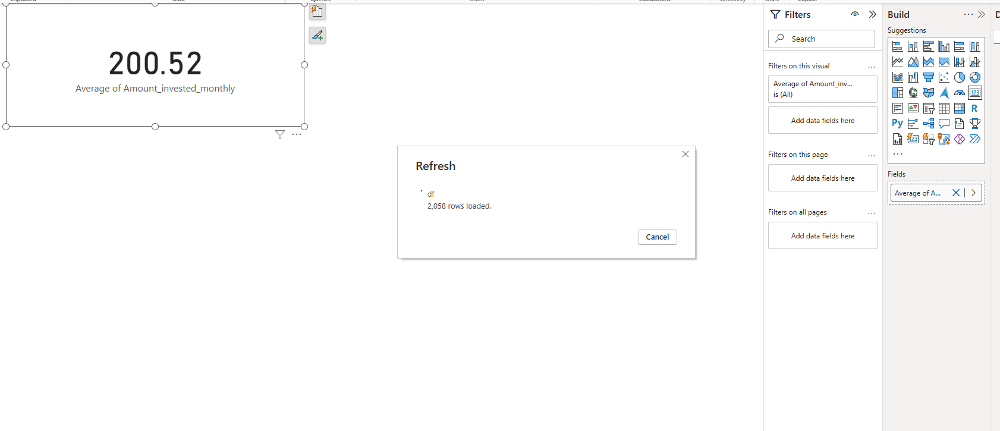
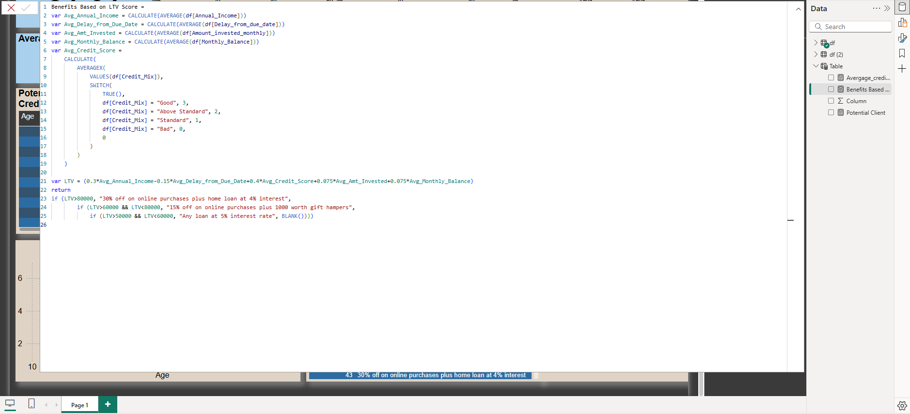

# Project 1: Global Superstore Project

## Overview
A project to analyze sales and profit of a global superstore, utilizing slicers, AI Q&A visuals, maps etc. in Power BI.

# Project 2: Financial Data Analytics Project

## Overview
An end-to-end data processing solution leveraging MS Outlook Rules for email segregation, Power Automate for attachment retrieval, Python for data processing, Power Query for transformation, and Google Cloud Platform for secure integration of Google Drive with Power BI. 
Implemented advanced DAX formulas enabling customer lifetime value (LTV) analysis and potential customer identification.

## Features
Incoming email messages with relevant attachments trigger the following automated workflow:
- Automatic grouping of relevant attachments into a folder using Outlook Rules
- Automatic upload of files to Google Drive via GCP Google Drive API key using Power Automate
- Preprocessing and loading of uploaded files through Python queries within a Power BI environment
- Automatic data transformation via Power Query
- Automatic dashboard updates via Power BI visualization
  
## Technologies Used
- **Email Management**: MS Outlook Rules
- **Workflow Automation**: Microsoft Power Automate
- **Data Processing**: Python
- **Data Transformation**: Power Query
- **Cloud Integration**: Google Cloud Platform (API Keys) for Drive
- **Data Visualization**: Power BI with DAX formulas

